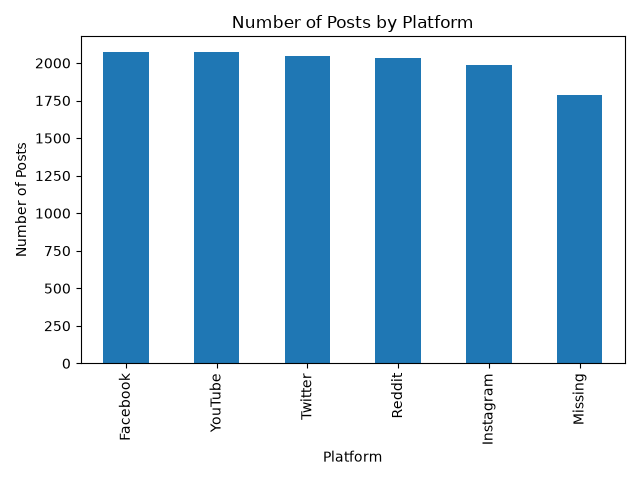
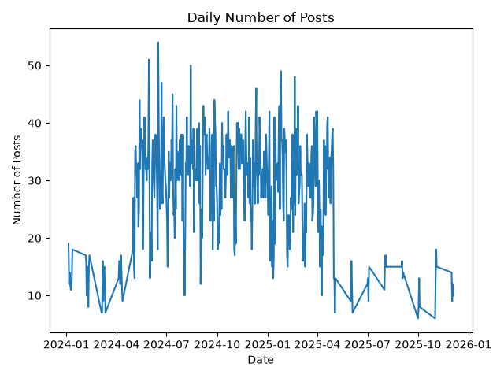
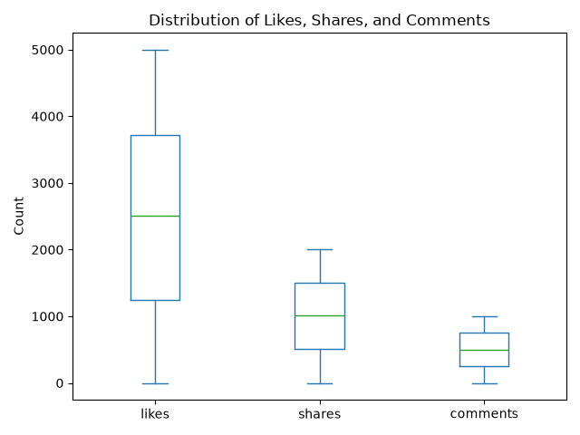

# Social Engine Dataset Cleaning and EDA Report

## 1. Objective

The objective of this phase was to recover, clean, validate, and explore the corrupted Social Engine dataset.

## 2. Dataset overview

The dataset contains:

- 1,500 users
- 12,360 raw post rows
- 12,000 post rows after duplicate removal

The users dataset contains user information. The posts dataset contains social-media activity.

## 3. Problems found in the raw data

The raw posts dataset contained:

- 360 exact duplicate rows
- Missing platform values
- Missing text values
- Missing likes values
- Negative likes
- Mixed timestamp formats
- HTML-encoded text values

## 4. Cleaning decisions

| Problem | Action | Reason |
|---|---|---|
| Exact duplicate rows | Removed duplicate copies | Prevent double-counting |
| Missing platform | Kept as missing | Platform cannot be reliably inferred |
| Missing text | Kept as missing | Text should not be invented |
| Missing likes | Kept as missing | Missing does not mean zero |
| Negative likes | Converted to missing | Likes cannot be negative |
| Mixed timestamps | Standardized to datetime | Makes time analysis consistent |
| HTML entities | Decoded | Restores readable text |

## 5. Validation

After cleaning:

- Duplicate post rows: 0
- Duplicate post IDs: 0
- Duplicate user IDs: 0
- Unknown user IDs: 0
- Negative likes: 0
- Negative shares: 0
- Negative comments: 0
- Invalid timestamps: 0

## 6. Exploratory analysis

### 6.1 Platform distribution

The platform counts were:

- Facebook: 2,074
- YouTube: 2,073
- Twitter: 2,049
- Reddit: 2,031
- Instagram: 1,989
- Missing: 1,784

The platforms are relatively balanced. Missing platform values were retained as a separate category.

### 6.2 Time distribution

The posts range from 5 January 2024 to 4 December 2025.

The highest daily volume was 54 posts on 16 June 2024.

### 6.3 Engagement distribution

| Metric | Valid values | Missing values | Mean | Median |
|---|---:|---:|---:|---:|
| Likes | 9,677 | 2,323 | 2,493.51 | 2,502 |
| Shares | 12,000 | 0 | 1,007.17 | 1,018 |
| Comments | 12,000 | 0 | 504.35 | 503 |

Likes contain 2,323 missing values. These were not converted to zero because missing information does not prove that the post had no likes.

## 7. Conclusion

The cleaned dataset contains 1,500 users and 12,000 unique posts. The data is suitable for SQL analysis after duplicate removal, timestamp standardization, missing-value handling, and validation.