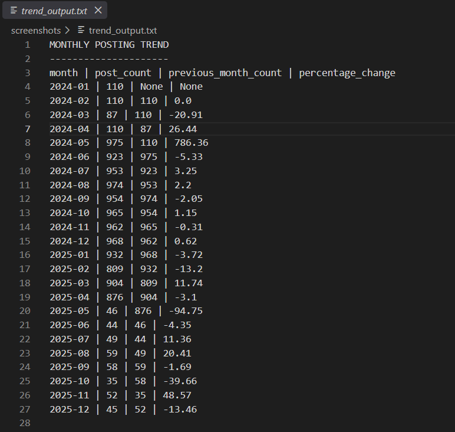
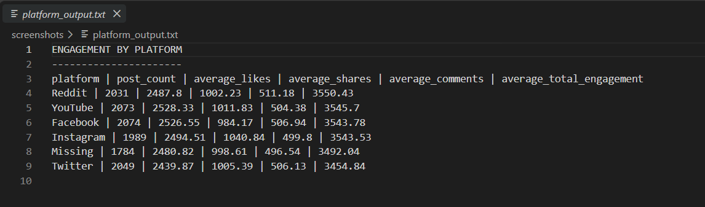
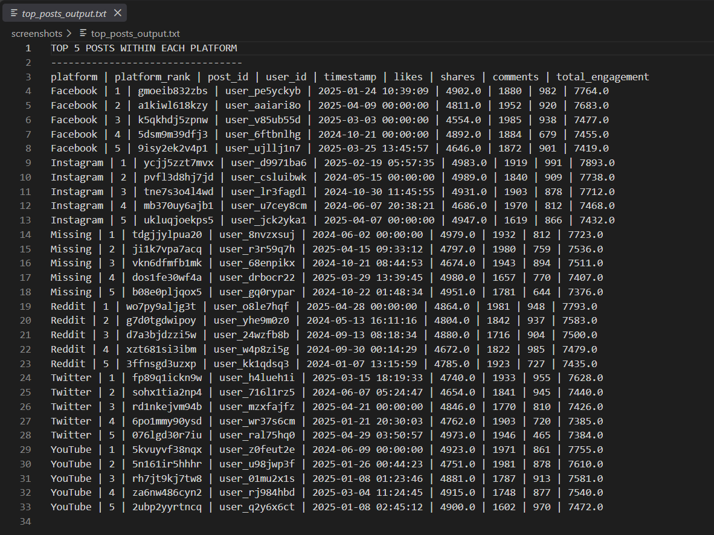
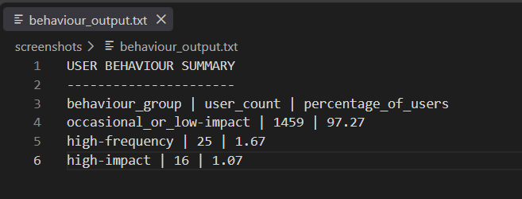
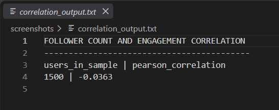
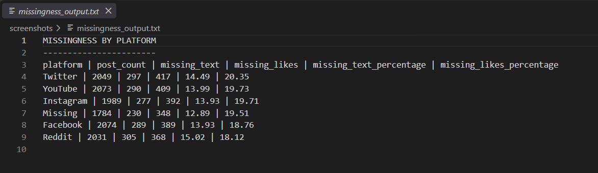

# Social Engine Phase 2 SQL Analysis Report

## 1. Objective

The objective of Phase 2 was to load the cleaned Social Engine data into SQL tables and use reproducible queries to analyze trends, engagement, user behaviour, correlations, and data-quality issues.

All results in this report were generated from the SQLite database. The outputs were not manually hardcoded.

---

## 2. Database schema

The database contains two tables.

### Users table

| Column | Description |
|---|---|
| `user_id` | Unique user identifier |
| `location` | User location |
| `language` | User language |
| `account_created` | Account creation date |
| `follower_count` | Number of followers |

### Posts table

| Column | Description |
|---|---|
| `post_id` | Unique post identifier |
| `user_id` | User who created the post |
| `platform` | Social-media platform |
| `text_content` | Post text |
| `timestamp` | Standardized post timestamp |
| `likes` | Number of likes |
| `shares` | Number of shares |
| `comments` | Number of comments |
| `timestamp_original` | Original timestamp before standardization |

The relationship between the tables is:

```text
users.user_id = posts.user_id
```

The database contains:

- 1,500 users
- 12,000 cleaned posts

The users and posts tables are kept separate because user information should not be unnecessarily duplicated across every post record.

---

## 3. Query 1: Monthly posting trend

### SQL file

```text
sql/trend_query.sql
```

### Question

How did the number of posts change from month to month?

### SQL techniques used

- Common Table Expressions using `WITH`
- `GROUP BY`
- `COUNT`
- `LAG`
- Percentage-change calculation
- `NULLIF` to avoid division by zero

### Query logic

The first part of the query groups posts by month and counts the number of posts.

The second part uses the `LAG()` window function to retrieve the previous month’s post count.

The final part calculates the percentage change:

```text
(current month count - previous month count)
/
previous month count
× 100
```

The first month has no previous month, so its percentage change is `NULL`. This is expected.

### Main result

Activity increased from:

```text
April 2024: 110 posts
May 2024: 975 posts
```

This represents a:

```text
786.36% increase
```

Activity later decreased from:

```text
April 2025: 876 posts
May 2025: 46 posts
```

This represents a:

```text
94.75% decrease
```

### Interpretation

Monthly activity shows two major structural changes. The first is a sharp increase in May 2024. The second is a sharp decrease in May 2025.

These changes should be treated as activity shifts requiring investigation. They should not automatically be classified as data errors because a large change in volume does not, by itself, prove that the records are invalid.

The 786.36% increase is also influenced by the relatively small April 2024 baseline of 110 posts.

### Output screenshot



---

## 4. Query 2: Engagement by platform

### SQL file

```text
sql/platform_engagement.sql
```

### Question

Which platforms have the highest average engagement?

### SQL techniques used

- `GROUP BY`
- `COUNT`
- `AVG`
- `ROUND`
- `COALESCE`
- Aggregate comparison

### Query logic

The query groups posts by platform and calculates:

- Number of posts
- Average likes
- Average shares
- Average comments
- Average total engagement

The expression below calculates total engagement:

```sql
COALESCE(likes, 0) + shares + comments
```

For this combined engagement calculation only, missing likes are treated as zero so that posts are not removed from the comparison.

The original missing values in the `likes` column remain missing in the database.

### Result

| Platform | Posts | Average likes | Average shares | Average comments | Average total engagement |
|---|---:|---:|---:|---:|---:|
| Reddit | 2,031 | 2,487.80 | 1,002.23 | 511.18 | 3,550.43 |
| YouTube | 2,073 | 2,528.33 | 1,011.83 | 504.38 | 3,545.70 |
| Facebook | 2,074 | 2,526.55 | 984.17 | 506.94 | 3,543.78 |
| Instagram | 1,989 | 2,494.51 | 1,040.84 | 499.80 | 3,543.53 |
| Missing | 1,784 | 2,480.82 | 998.61 | 496.54 | 3,492.04 |
| Twitter | 2,049 | 2,439.87 | 1,005.39 | 506.13 | 3,454.84 |

### Interpretation

Reddit has the highest average total engagement per post at:

```text
3,550.43
```

Twitter has the lowest average total engagement per post at:

```text
3,454.84
```

The difference is:

```text
3,550.43 - 3,454.84 = 95.59
```

The difference is relatively small compared with the overall engagement values. Therefore, platform alone does not explain engagement.

A suitable conclusion is:

> Reddit has the highest average total engagement in this dataset, but the platform averages are close. Platform should be treated as one contextual factor rather than the only explanation for engagement.

### Important assumption

Missing likes were treated as zero only for the combined engagement calculation. This may underestimate the true engagement of posts where likes were unavailable.

The original missing likes were preserved and were not permanently replaced with zero.

### Output screenshot



---

## 5. Query 3: Top posts within each platform

### SQL file

```text
sql/top_posts.sql
```

### Question

Which posts have the highest engagement within each platform?

### SQL techniques used

- Common Table Expression using `WITH`
- `ROW_NUMBER`
- `PARTITION BY`
- Ranking within groups
- `COALESCE`

### Query logic

The query calculates total engagement for each post:

```text
likes + shares + comments
```

Missing likes are treated as zero only for this ranking calculation.

The `ROW_NUMBER()` function ranks posts within each platform:

```sql
ROW_NUMBER() OVER (
    PARTITION BY platform
    ORDER BY total_engagement DESC
)
```

The `PARTITION BY` clause ensures that posts are ranked separately for each platform.

The query returns the five highest-engagement posts within every platform category.

### Result summary

The output contains five ranked posts for each platform category:

- Facebook
- Instagram
- Missing
- Reddit
- Twitter
- YouTube

The highest visible result was an Instagram post with total engagement of:

```text
7,893
```

### Interpretation

Ranking posts separately within each platform provides a fairer comparison than creating one overall ranking.

Without `PARTITION BY`, the results could be dominated by one platform. With `PARTITION BY`, each platform receives its own ranking.

The output includes the `Missing` platform category. This is intentional because posts without platform information should not be silently removed.

The result is generated dynamically from the database. It is not hardcoded.

### Limitation

A high-performing individual post does not prove that its platform has the highest average engagement.

The top-post ranking and the platform-average query answer different questions:

- The ranking query finds individual high-performing posts.
- The platform query compares average platform performance.

### Output screenshot



---

## 6. Query 4: User behaviour groups

### SQL files

Detailed user-group query:

```text
sql/user_behaviour.sql
```

Summary query:

```text
sql/user_behaviour_summary.sql
```

### Question

Can users be grouped based on posting frequency and average engagement?

### SQL techniques used

- `INNER JOIN`
- `COUNT`
- `AVG`
- Common Table Expressions
- `CASE`
- Conditional classification
- `GROUP BY`

### Behaviour groups

| Group | Meaning |
|---|---|
| `high-frequency_high-impact` | Many posts and high average engagement |
| `high-frequency` | Many posts but lower average engagement |
| `high-impact` | Fewer posts but high average engagement |
| `occasional_or_low-impact` | Lower posting frequency and lower average engagement |

The thresholds used are:

```text
High-frequency: at least 15 posts
High-impact: average engagement of at least 5,000
```

### Result

| Behaviour group | Users | Percentage |
|---|---:|---:|
| `occasional_or_low-impact` | 1,459 | 97.27% |
| `high-frequency` | 25 | 1.67% |
| `high-impact` | 16 | 1.07% |
| `high-frequency_high-impact` | 0 | 0.00% |

The percentages total approximately 100%. Minor differences may occur because the values are rounded to two decimal places.

### Interpretation

Most users were classified as occasional or low-impact:

```text
1,459 users, or 97.27% of the sample
```

Only 41 users belonged to either the high-frequency or high-impact categories.

No user met both thresholds simultaneously.

This suggests that high activity and high average engagement are concentrated among a small number of users.

### Limitation

The thresholds of 15 posts and 5,000 average engagement are operational definitions created for this analysis.

They are not universal industry standards. Changing the thresholds would change the group sizes.

### Output screenshot



---

## 7. Query 5: Follower count and engagement correlation

### SQL file

```text
sql/follower_correlation.sql
```

### Question

Is follower count related to average engagement?

### SQL techniques used

- Common Table Expressions
- `INNER JOIN`
- `AVG`
- Centered values
- Pearson correlation calculation
- `CROSS JOIN`
- `ROUND`
- `NULLIF`

### Result

```text
Users in sample: 1,500
Pearson correlation: -0.0363
```

### Interpretation

The correlation is very close to zero:

```text
-0.0363 ≈ 0
```

This indicates almost no linear relationship between follower count and average engagement in this sample.

A suitable conclusion is:

> The Pearson correlation between follower count and average user engagement was -0.0363 across 1,500 users. This indicates almost no linear association in the sample. Therefore, follower count alone does not appear to be a reliable predictor of average engagement.

### Limitations

This result measures linear association only.

It does not prove that follower count can never influence engagement.

Other factors may still matter, including:

- Platform
- Post topic
- Text content
- Posting time
- Nonlinear relationships
- Missing likes

The engagement calculation also treats missing likes as zero for the combined engagement measure. This may underestimate engagement for posts where likes were unavailable.

Correlation does not prove causation.

### Output screenshot



---

## 8. Query 6: Missingness by platform

### SQL file

```text
sql/missingness_by_platform.sql
```

### Question

Does data quality vary by platform?

### SQL techniques used

- `GROUP BY`
- `COUNT`
- `SUM`
- `CASE`
- `COALESCE`
- Percentage calculation

### Query logic

The query calculates, for each platform:

- Total post count
- Number of missing text values
- Number of missing likes values
- Percentage of missing text
- Percentage of missing likes

The `CASE` expression checks whether a field is missing.

The `SUM` function counts the rows where the condition is true.

### Result

| Platform | Posts | Missing text | Missing text % | Missing likes | Missing likes % |
|---|---:|---:|---:|---:|---:|
| Twitter | 2,049 | 297 | 14.49% | 417 | 20.35% |
| YouTube | 2,073 | 290 | 13.99% | 409 | 19.73% |
| Instagram | 1,989 | 277 | 13.93% | 392 | 19.71% |
| Missing platform | 1,784 | 230 | 12.89% | 348 | 19.51% |
| Facebook | 2,074 | 289 | 13.93% | 389 | 18.76% |
| Reddit | 2,031 | 305 | 15.02% | 368 | 18.12% |

### Interpretation

Twitter has the highest missing-like rate:

```text
20.35%
```

Reddit has the lowest missing-like rate:

```text
18.12%
```

However, missing likes occur across all platform categories. This suggests that missing likes are a broad intake-quality issue rather than a problem isolated to one platform.

Reddit has the highest missing-text rate:

```text
15.02%
```

There are also 1,784 posts without a platform value. These posts were retained under the separate `Missing` category.

No platform was inferred without evidence.

### Output screenshot



---

## 9. Limitations and assumptions

### Missing likes

Missing likes were treated as zero only when calculating combined engagement.

This may underestimate engagement for posts where likes were unavailable.

The original missing values were preserved in the cleaned dataset.

### Behaviour thresholds

The thresholds used for behavioural grouping were:

```text
At least 15 posts
At least 5,000 average engagement
```

These thresholds were created for this analysis and should not be treated as universal industry standards.

### Correlation

The Pearson correlation measures linear association only.

It does not prove causation and does not detect every possible type of relationship.

### Monthly trends

The monthly trend query identifies changes in activity but does not explain why those changes occurred.

The large percentage increases and decreases are sensitive to the size of the comparison month.

### Missing platform values

Posts with missing platforms were retained rather than deleted or assigned to a platform without evidence.

---

## 10. Conclusion

The cleaned Social Engine data was successfully loaded into a two-table SQLite database containing 1,500 users and 12,000 posts.

Reproducible SQL queries were used to:

1. Detect monthly posting trends.
2. Compare engagement by platform.
3. Rank top posts within each platform.
4. Group users by activity and impact.
5. Measure the relationship between follower count and engagement.
6. Monitor missing values by platform.

The main findings are:

1. Posting activity changed sharply during the observation period.
2. Reddit had the highest average total engagement, but platform differences were small.
3. High activity and high engagement were concentrated among a small number of users.
4. Follower count had almost no linear relationship with average engagement.
5. Missing likes were common across every platform category.
6. Missing platform values were retained as an explicit data-quality category.

All query results were generated from the SQL database rather than hardcoded.

This report, the SQL files, the database setup script, and the cleaned datasets together provide a reproducible Phase 2 workflow.
