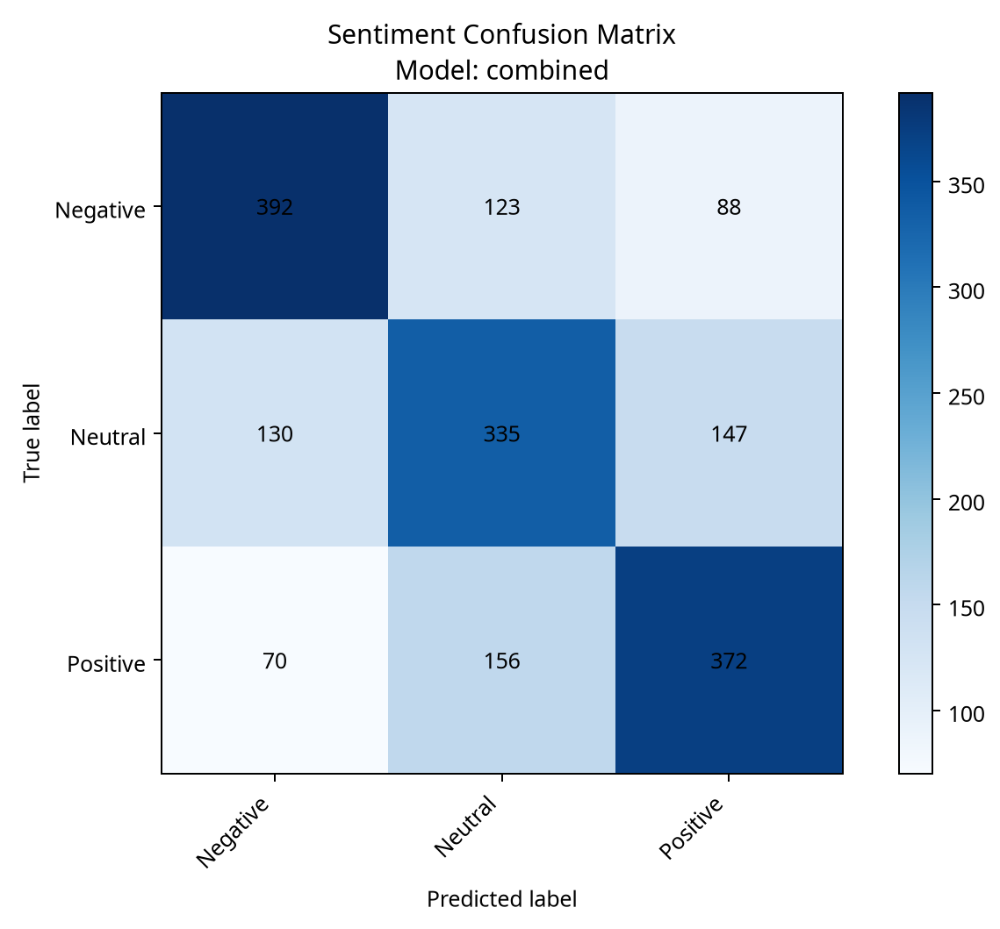
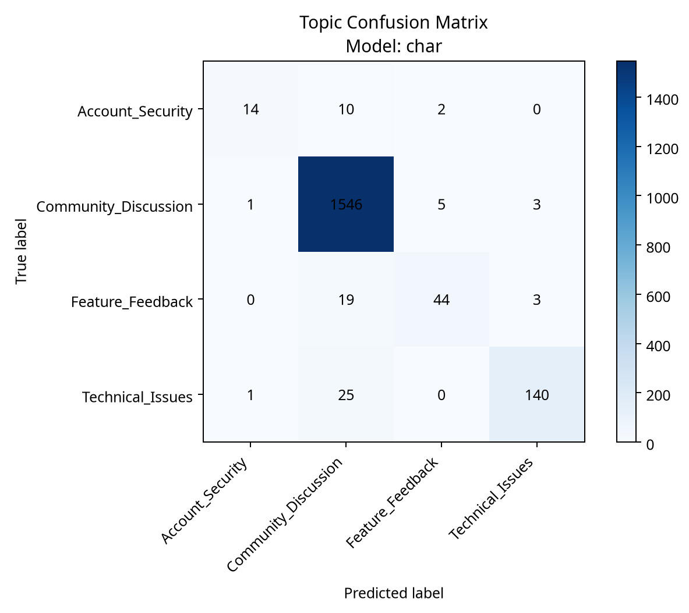

# Data Vortex 2026 - Round 2 Technical Report

## 1. Problem Definition

The Social Engine requires a semantic layer capable of interpreting short human-language posts.

This project builds two classifiers:

```text
post_text -> sentiment_label
post_text -> topic_category
```

The sentiment model predicts Positive, Negative, or Neutral. The topic model predicts the category of the post.

## 2. Dataset Overview

The dataset contains 9,000 records and four source columns:

```text
text_id
post_text
sentiment_label
topic_category
```

The inspection found no missing values, blank text values, duplicate complete rows, or duplicate text IDs.

There are 7,900 unique text values and 987 repeated text values. Repeated texts have no conflicting labels.

The sentiment labels are balanced with 3,000 records per class. The topic labels are strongly imbalanced.

## 3. Preprocessing Pipeline

The preprocessing pipeline:

1. Decodes HTML entities.
2. Decodes escaped Unicode sequences where possible.
3. Replaces URLs with `URLTOKEN`.
4. Replaces mentions with `USERTOKEN`.
5. Normalizes whitespace.
6. Converts text to lowercase.
7. Creates word-level unigram/bigram and character n-gram TF-IDF features.

The sentiment pipeline combines word and character TF-IDF features. The topic pipeline uses character n-grams with balanced class weights. Both use sublinear term frequency and regularized Logistic Regression.

## 4. Model Selection

Multiple TF-IDF configurations and Logistic Regression settings were compared:

- Word-level TF-IDF.
- Character-level TF-IDF.
- Combined word and character TF-IDF.

Configurations were selected using validation macro F1-score because macro F1 gives equal importance to every class.


Selected sentiment model: **combined_tfidf_logistic_regression**

Selected topic model: **char_tfidf_logistic_regression**

Final models were saved as:

```text
round2/models/sentiment_model.pkl
round2/models/topic_model.pkl
```

## 5. Training Methodology

| Split | Records |
|---|---:|
| Training | 5382 |
| Validation | 1805 |
| Testing | 1813 |

A group-aware split used the original text as the group. Therefore identical texts could not cross dataset splits.

Train/validation overlap: 0

Train/test overlap: 0

Validation/test overlap: 0

The selected model was retrained on training plus validation records and evaluated once on the untouched test set.

## 6. Evaluation Metrics

### Sentiment classification

| Metric | Score |
|---|---:|
| Accuracy | 0.6062 |
| Macro precision | 0.6069 |
| Macro recall | 0.6065 |
| Macro F1-score | 0.6067 |
| Weighted F1-score | 0.6063 |

Per-class results:

| Class | Precision | Recall | F1-score | Support |
|---|---:|---:|---:|---:|
| Negative | 0.6622 | 0.6501 | 0.6561 | 603 |
| Neutral | 0.5456 | 0.5474 | 0.5465 | 612 |
| Positive | 0.6129 | 0.6221 | 0.6174 | 598 |

### Topic classification

| Metric | Score |
|---|---:|
| Accuracy | 0.9619 |
| Macro precision | 0.9157 |
| Macro recall | 0.7607 |
| Macro F1-score | 0.8241 |
| Weighted F1-score | 0.9597 |

Per-class results:

| Class | Precision | Recall | F1-score | Support |
|---|---:|---:|---:|---:|
| Account_Security | 0.8750 | 0.5385 | 0.6667 | 26 |
| Community_Discussion | 0.9663 | 0.9942 | 0.9800 | 1555 |
| Feature_Feedback | 0.8627 | 0.6667 | 0.7521 | 66 |
| Technical_Issues | 0.9589 | 0.8434 | 0.8974 | 166 |

## 7. Confusion Matrices

### Sentiment



### Topic



The matrices show strong majority-class performance and more difficulty with neutral sentiment and minority topics.

## 8. Error Analysis

The error files were generated from final test predictions:

```text
round2/reports/sentiment_errors.csv
round2/reports/topic_errors.csv
```

### Sentiment error examples

| Text ID | Actual label | Predicted label | Text |
|---|---|---|---|
| TXT_00003 | Positive | Neutral | Would you like to join us at our annual gala at the Sandman Signature Resort on Oct 25? Contact our centre at 6042773100 for tickets! |
| TXT_00010 | Neutral | Positive | "1st game played under Solar Powered floodlights in the world happened in MYSA,Nairobi Kenya. #PhilipsLED" |
| TXT_00092 | Negative | Neutral | I may have just dropped two letter grades of intelligence after listening to that Kanye West rant... |
| TXT_00108 | Negative | Neutral | November 21 in the lonely hour tour.. OKAY SAM SMITH OKAY!!!! :-(((( TAPOS SOLD OUT PA OKAY!!!!! OKAY LANG TALAGA |
| TXT_00131 | Neutral | Positive | @user Milan, in my opinion, have only the 7th best squad, after Inter, Roma, Juventus, Lazio, Napoli and Fiorentina." |

Typical causes include sarcasm, slang, mixed sentiment, short text, and neutral language containing emotional words.

### Topic error examples

| Text ID | Actual label | Predicted label | Text |
|---|---|---|---|
| TXT_00079 | Account_Security | Community_Discussion | bloodymary - hackers nirvana - smell like teen spirit butterfingers - nicotine feeder - 7 days in the sun smashing pumpkins - bullets with.. |
| TXT_00296 | Technical_Issues | Community_Discussion | SUN UPDATE: UFC 191, Beyonce with Ronda Rousey, Jimmy Snuka, TUF, New WWE stable, CHIKARA King of Trios |
| TXT_00643 | Feature_Feedback | Community_Discussion | I don't see why justin thinks it's okay to work Tuesday's.. It's fall were supposed to get $1 burgers at bar Louie and blackout |
| TXT_00807 | Account_Security | Community_Discussion | Will Fleeing Syrians Flood the Food banks or be served at The Ritz ?  David Cameron Merkel Duncan Smith Theresa May The Pope Sentimentalists |
| TXT_00820 | Account_Security | Community_Discussion | "may the gods speed him, RIP, Frank Gifford, New York Giants legend and husband to Kathy Lee Gifford, dead at 84 |

Topic errors are concentrated in minority categories because those categories contain fewer training examples and share vocabulary with other topics.

## 9. Limitations

The topic dataset is highly imbalanced. The model performs better on Community Discussion than on the smallest classes.

TF-IDF cannot fully understand sarcasm, outside context, world knowledge, or subtle meaning.

Future improvements could include character features, transformer embeddings, cross-validation, hyperparameter tuning, and additional minority-class data.

## 10. Reproducibility

Run these commands from the project root:

```powershell
python "round2\src\inspect_dataset.py"
python "round2\src\check_text_duplicates.py"
python "round2\src\train_models.py"
python "round2\src\generate_reports.py"
```

## 11. Conclusion

This project rebuilds the Social Engine semantic layer using text normalization, duplicate-aware splitting, TF-IDF features, model comparison, final test evaluation, confusion matrices, and error analysis.

The resulting system performs sentiment recognition and topic classification with transparent evaluation and documented limitations.